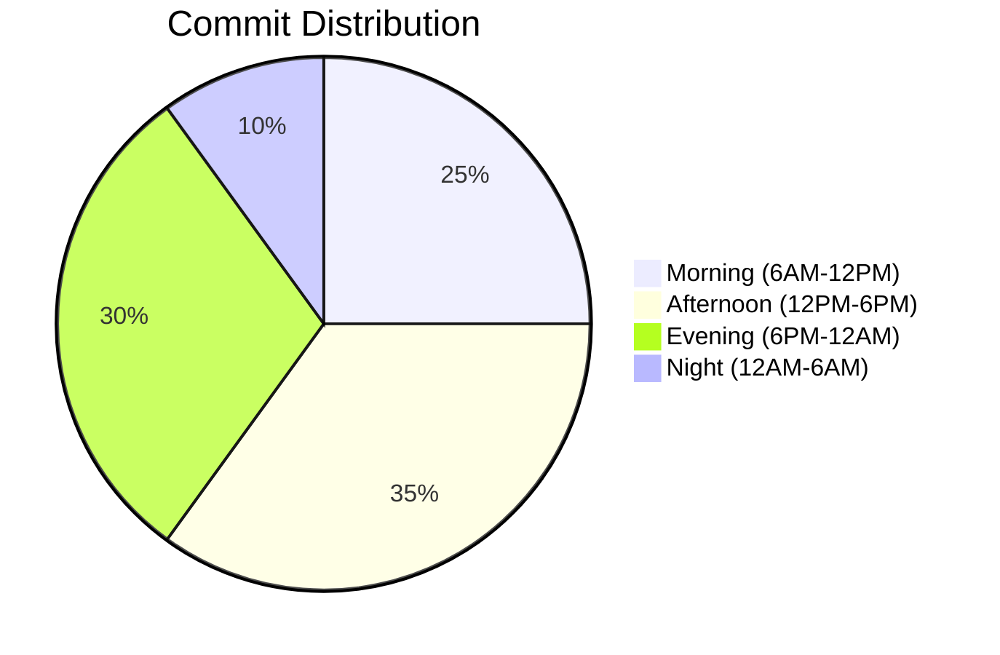
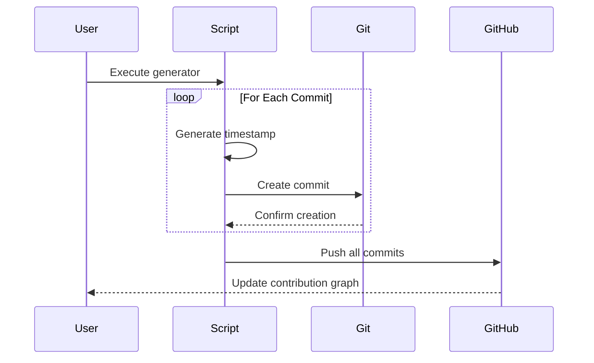
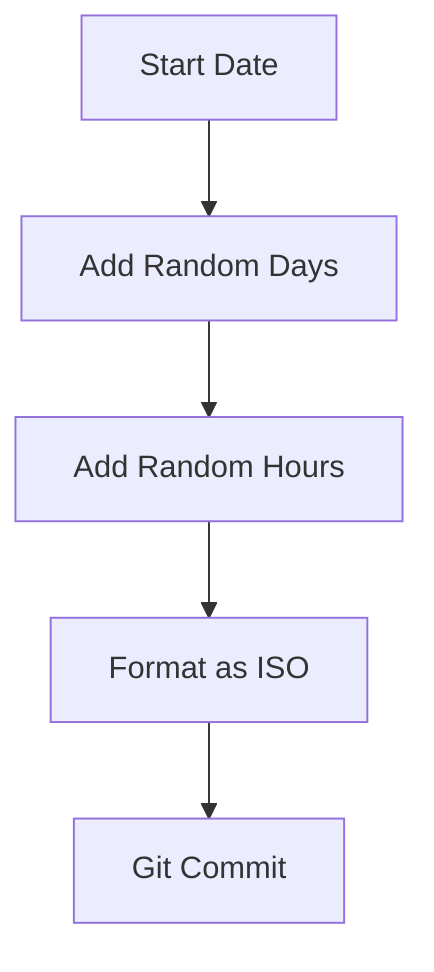

---

<p align="center">
  
  
  
  
</p>

# Git Contribution Architect ⏳  
**Precision GitHub Timeline Generator**  

Create authentic-looking commit histories with surgical precision. Perfect for testing contribution graphs, CI/CD pipelines, or Git experimentation.

---

## Table of Contents  
- [Features](#features-✨)  
- [Requirements](#requirements-📋)  
- [Quick Setup](#quick-setup-🚀)  
- [Customization](#customization-🎛️)  
- [Workflow](#workflow-🔧)  
- [Best Practices](#best-practices-⚠️)  

---

## Features ✨  
- 🗓️ Custom date ranges with hour/minute precision  
- 📈 Multiple commit distribution patterns  
- 🔧 Environment variable overrides  
- 📊 Visual progress tracking  
- ⚙️ Git integration with timestamp validation  

---

## Requirements 📋  
1. [Node.js v18+](https://nodejs.org/)  
2. [Git 2.25+](https://git-scm.com/)  
3. GitHub repository (empty or existing)

---

## Quick Setup 🚀  

### 1. Initialize Project  
```bash
mkdir git-history && cd git-history
npm init -y
```

### 2. Install Dependencies  
```bash
npm install moment jsonfile simple-git
```

### 3. Create Generator Script  
`index.js`:
```javascript
const jsonfile = require('jsonfile');
const moment = require('moment');
const simpleGit = require('simple-git');
const FILE_PATH = './.gitdates';

// Configuration
const COMMIT_COUNT = process.env.COMMITS || 500;
const DATE_RANGE = {
  start: process.env.START || '2024-04-07',
  end: process.env.END || '2024-12-29'
};

const totalDays = moment(DATE_RANGE.end).diff(DATE_RANGE.start, 'days');

const makeCommit = (n) => {
  if(n <= 0) return simpleGit().push();
  
  const dayOffset = Math.floor(Math.random() * (totalDays + 1));
  const commitDate = moment(DATE_RANGE.start)
    .add(dayOffset, 'days')
    .add(Math.random() * 24, 'hours')
    .format();

  console.log(`Commit ${COMMIT_COUNT - n + 1}/${COMMIT_COUNT} → ${commitDate}`);

  jsonfile.writeFile(FILE_PATH, { date: commitDate }, () => {
    simpleGit().add([FILE_PATH])
      .commit(commitDate, { '--date': commitDate }, makeCommit.bind(this, --n));
  });
};

makeCommit(COMMIT_COUNT);
```

### 4. Connect to GitHub  
```bash
git init
git remote add origin YOUR_REPO_URL
```

### 5. Generate & Push  
```bash
node index.js && git push -u origin main
```

---

## Customization 🎛️  

### Date Distribution  


### Configuration Options  
| Parameter          | Description                          | Default           |
|--------------------|--------------------------------------|-------------------|
| `COMMITS`          | Total number of commits              | 500               |
| `START`            | Start date (YYYY-MM-DD)              | 2024-04-07        |
| `END`              | End date (YYYY-MM-DD)                | 2024-12-29        |

**Runtime Overrides:**
```bash
COMMITS=1000 START=2024-01-01 END=2024-06-30 node index.js
```

---

## Workflow 🔧  

### Commit Generation Process  


### Date Calculation Logic  


---

## Best Practices ⚠️  

1. **Repository Setup**  
   - Use dedicated test repositories
   - Disable actions/CI temporarily
   - Clean history before generation

2. **Ethical Guidelines**  
   - Never falsify project history
   - Add `.bot-commits` file to root
   - Disclose automation in README

3. **Performance Tips**  
   - 500 commits ≈ 5-8 minutes
   - 5,000 commits ≈ 45-60 minutes
   - Use `--no-verify` flag for large batches

4. **Troubleshooting**  
   ```bash
   # Verify local commits
   git log --pretty=format:"%h %ad %s" --date=iso
   
   # Force push if needed
   git push -f origin main
   ```

---

<p align="center">
  🔍 GitHub may filter artificial patterns - Use responsibly!<br>
  💡 Real contributions always trump automated metrics
</p>

---
